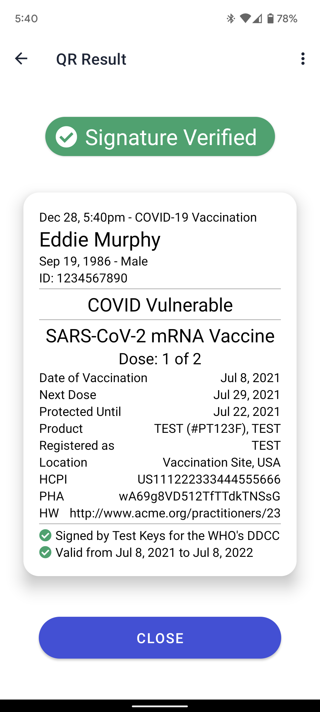

# World Health Organization's DDCC Verifier App



COVID-19 Credential Verifier app for Android using the WHO's Digital Documentation of COVID-19 Certificates. The app scans a QR code for a credential/pass, cryptographically verifies it and displays the results on the phone. No information is transmitted anywhere. Our goal is to make a Verifier App with the widest possible verification capabilities.

# Current Features

- [x] 0. Base Kotlin App
- [x] 1. Screen Flow
- [x] 1.1. Home Screen
- [x] 1.2. Camera Screen
- [x] 1.3. Result Screen
- [x] 2. Camera Development
- [x] 2.1. Manage Permissions
- [x] 2.2. Camera View
- [x] 2.3. QRs Finding and Processing
- [x] 3. Displaying Card Info on Screen
- [x] 3.1. Display Patient Info
- [x] 3.2. Display Vaccine Info
- [x] 3.3. Display Test Result Info
- [x] 3.4. Display Error Messages
- [x] 4. QR Unpacking into Verifiable Credential
- [x] 4.1 QR to COSE-signed CBOR
- [x] 4.2 COSE-signed CBOR to FHIR DDCC Composite
- [x] 4.3 FHIR DDCC Composite to Screen Card
- [x] 5. Credential Verification (Off-line)
- [x] 5.1. Public Key Resolver (Key Management)
- [x] 5.2. Check Trust of Public Key
- [x] 5.3. Cryptographic verification
- [x] 5.4. Error handling
- [ ] 6. Credential Status Verification (On-line)
- [ ] 6.1. Call issuer to check status of the credential
- [ ] 6.2. Call issuer to download a new version of the Credential.
- [ ] 6.3. Screen changes to inform updates/issues
- [x] 7. Rule Engine Integration (CQL)
- [x] 7.1. Load FHIR Models & Context
- [x] 7.2. Load Rules Library
- [x] 7.3. Run Rule engines on the FHIR dataset.
- [ ] 8. Key Cloak Integration
- [ ] 8.1. Define the need for screens.
- [x] 9. DIVOC Processing.
- [x] 9.1. Unpack and Verify
- [x] 9.2. Trust Registry check
- [x] 9.3. Display Info on Screen
- [x] 10. SHC Processing
- [x] 10.1. Unpack and Verify
- [x] 10.2. Trust Registry check
- [x] 10.3. Display Vacination Info on Screen
- [ ] 10.4. Display Test Info on Screen
- [ ] 10.5. Display Recovery Info on Screen
- [ ] 11. ICAO Processing.
- [ ] 11.1. Unpack and Verify
- [ ] 11.2. Trust Registry check
- [ ] 11.3. Display Info on Screen
- [x] 12. EU DCC Processing.
- [x] 12.1. Unpack and Verify
- [x] 12.2. Trust Registry check
- [x] 12.3. Display Vacination Info on Screen
- [ ] 12.4. Display Test Info on Screen
- [ ] 12.5. Display Recovery Info on Screen

# Development Overview

## Setup

Make sure to have the following pre-requisites installed:
1. Java 11
2. Android Studio Artic Fox+
3. Android 7.0+ Phone or Emulation setup

Fork and clone this repository and import into Android Studio
```bash
git clone git@github.com:Path-Check/who-verifier-app.git
```

Use one of the Android Studio builds to install and run the app in your device or a simulator.

## Building
Build the app:
```bash
./gradlew assembleDebug
```

## Testing
```bash
./gradlew test
./gradlew connectedAndroidTest
```

## Installing on device
```bash
./gradlew installDebug
```

## Screen + Class flow overview

```
┌──────────────────────────────────────────────────┐      ┌────────────────┐ ┌──────────┐
│                  MainActivity                    │      │ TrustRegistry  ├↔┤ KeyUtils │
└──────────────────────────────────────────────────┘      └─────────────╥──┘ └──────────┘
┌──────────────┐ ┌──────────────┐ ┌────────────────┐                    ║
│ HomeFragment ├→┤ ScanFragment ├→┤ ResultFragment │←─DDCC UI Card──────╫─────────┐
└──────────────┘ └─────┬──▲─────┘ └────────┬───────┘                    ║         │
                  Image│  │QRContent       │QRContent                   ║         │
                 ┌─────▼──┴─────┐     ┌────▼───────┐                    ║         │
                 │   QRFinder   │     │ QRDecoder  │                    ║         │
                 └──────────────┘     └────┬───────┘                    ║         │
                                           │QRContent                   ║         │
            ┌─────────────────┬────────────┴─────┬───────────────────┐  ║         │
 ╔══════════╪═════════════════╪══════════════════╪═══════════════════╪══╩══════╗  │
 ║ ┌────────▼───────┐  ┌──────▼──────┐   ┌───────▼───────┐   ┌───────▼───────┐ ║  │
 ║ │  HCertVerifier │  │ SHCVerifier │   │ DivocVerifier │   │ ICAOVerifier  │ ║  │
 ║ └────┬───────────┘  └──────┬──────┘   └───────┬───────┘   └───────┬───────┘ ║  │
 ╚══════╪═════════════════════╪══════════════════╪═══════════════════╪═════════╝  │
        │HCERT CBOR           │JWT               │JSONLD             │iJSON       │
   ┌────▼───────────┐ ┌───────▼───────┐ ┌────────▼─────────┐ ┌───────▼─────────┐  │
   │ CBORTranslator │ │ JWTTranslator │ │ JSONLDTranslator │ │ iJSONTranslator │  │
   └────┬────────┬──┘ └───────┬───────┘ └────────┬─────────┘ └───────┬─────────┘  │
    FHIR│Struct  │DCC CWT     │FHIR DDCC         │FHIR DDCC          │FHIR DDCC   │
   ┌────▼─────┐┌─▼────────┐   │                  │                   │            │
   │ WHO2FHIR ││ DCC2FHIR │   │                  │                   │            │
   └────┬─────┘└────┬─────┘   │                  │                   │            │
    FHIR│DDCC   FHIR│DDCC     │                  │                   │            │
        └───────────┴─────────┴────────────┬─────┴───────────────────┘            │
                                           │                                      │
 ┌──────────────┐                          │DDCC Composite                        │
 │ Assets       │ ┌────────────────┐  ┌────▼───────────┐                          │
 │ - ModelInfo  ├↔┤CQLLibraryLoader├←→┤ CQLEvaluator   │                          │
 │ - FHIRHelper │ └────────────────┘  └────┬───────────┘                          │
 │ - DDCCPass   │                          │DDCC Composite                        │
 └──────────────┘                     ┌────▼───────────┐                          │
                                      │ DDCCFormatter  ├→─DDCC UI Card────────────┘
                                      └────────────────┘
```

## How to Deploy

1. Generate a new signing key 
```
keytool -genkey -v -keystore <my-release-key.keystore> -alias <alias_name> -keyalg RSA -keysize 2048 -validity 10000
```
2. Create 4 Secret Key variables on your GitHub repository and fill in with the signing key information
   - `KEY_ALIAS` <- `<alias_name>`
   - `KEY_PASSWORD` <- `<your password>`
   - `KEY_STORE_PASSWORD` <- `<your key store password>`
   - `SIGNING_KEY` <- the data from `<my-release-key.keystore>`
3. Change the `versionCode` and `versionName` on `app/build.gradle`
4. Commit and push. 
5. Tag the commit with `v{x.x.x}`
6. Let the [Create Release GitHub Action](https://github.com/Path-Check/who-verifier-app/actions/workflows/create-release.yml) build a new `aab` file. 
7. Add your CHANGE LOG to the description of the new release
8. Download the `aab` file and upload it to the` PlayStore. 

# Contributing

[Issues](https://github.com/Path-Check/who-verifier-app/issues) and [pull requests](https://github.com/Path-Check/who-verifier-app/pulls) are very welcome.

# License

Copyright 2021 PathCheck Inc

Licensed under the Apache License, Version 2.0 (the "License");
you may not use this file except in compliance with the License.
You may obtain a copy of the License at

       http://www.apache.org/licenses/LICENSE-2.0

Unless required by applicable law or agreed to in writing, software
distributed under the License is distributed on an "AS IS" BASIS,
WITHOUT WARRANTIES OR CONDITIONS OF ANY KIND, either express or implied.
See the License for the specific language governing permissions and
limitations under the License.